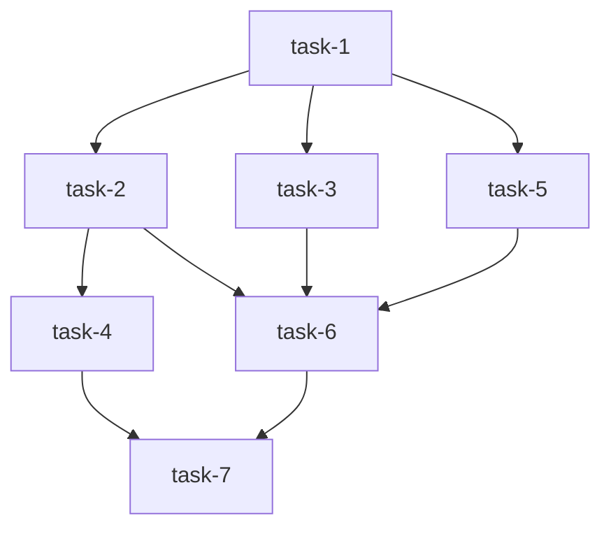

# Task Dependency Scheduler Implementation

## Overview
Successfully implemented a comprehensive task dependency scheduler in `src/tasks/scheduler.rs` that provides topological sorting, cycle detection, critical path calculation, and parallelizable task identification.

## Key Features Implemented

### 1. Topological Sorting (Kahn's Algorithm)
- **`schedule_tasks()`**: Main entry point that builds execution plans
- **`topological_sort()`**: Implements Kahn's algorithm for dependency resolution
- Returns execution order that preserves all dependencies
- Validates that all tasks can be processed (no cycles)

### 2. Cycle Detection (DFS with Coloring)
- **`detect_cycles()`**: Uses depth-first search with recursion stack
- **`dfs_detect_cycle()`**: Recursive helper for cycle detection
- Returns the actual cycle path for debugging
- Prevents infinite loops in dependency resolution

### 3. Critical Path Calculation
- **`calculate_critical_path()`**: Finds longest path through dependency graph
- **`longest_path()`**: Memoized recursive algorithm
- Identifies bottlenecks that determine minimum execution time
- Essential for project timeline estimation

### 4. Parallelizable Task Identification
- **`identify_parallelizable_tasks()`**: Finds tasks not on critical path
- Enables concurrent execution to improve throughput
- Calculates parallelism factor for resource planning

### 5. Execution Level Calculation
- **`calculate_execution_levels()`**: Groups tasks by execution level
- Tasks in the same level can execute in parallel
- Respects all dependency constraints
- Maximizes parallelism while maintaining correctness

## Data Structures

### ExecutionPlan
```rust
pub struct ExecutionPlan {
    pub execution_levels: Vec<Vec<Task>>,      // Tasks grouped by parallel level
    pub execution_order: Vec<String>,           // Flattened topological order
    pub critical_path: Vec<String>,             // Longest dependency chain
    pub parallelizable_tasks: HashSet<String>,  // Tasks that can run in parallel
    pub max_depth: usize,                       // Maximum graph depth
    pub total_tasks: usize,                     // Total number of tasks
}
```

### CycleDetectionResult
```rust
pub struct CycleDetectionResult {
    pub has_cycle: bool,
    pub cycle_path: Vec<String>,  // e.g., ["task-1", "task-2", "task-1"]
}
```

### GraphStatistics
```rust
pub struct GraphStatistics {
    pub total_tasks: usize,
    pub total_edges: usize,
    pub root_tasks: usize,           // Tasks with no dependencies
    pub leaf_tasks: usize,           // Tasks with no dependents
    pub max_depth: usize,
    pub critical_path_length: usize,
    pub parallelism_factor: f64,     // Average parallel tasks per level
}
```

## Algorithm Details

### Topological Sort (Kahn's Algorithm)
1. Calculate in-degree for all tasks (number of dependencies)
2. Initialize queue with tasks that have zero dependencies
3. While queue is not empty:
   - Remove task from queue and add to result
   - Reduce in-degree for all dependent tasks
   - Add dependent tasks with zero in-degree to queue
4. Validate all tasks were processed (detects cycles)

### Cycle Detection (DFS)
1. Use three states: unvisited, visiting (in recursion stack), visited
2. For each unvisited task, perform DFS
3. If we encounter a task in the recursion stack, we found a cycle
4. Return the cycle path for debugging

### Critical Path (Longest Path)
1. Use memoization to avoid redundant calculations
2. For each task, find longest path to any leaf node
3. Return the maximum length path overall
4. Time complexity: O(V + E) with memoization

### Execution Levels
1. Maintain set of processed tasks
2. Find all tasks whose dependencies are satisfied
3. Group these tasks into current level
4. Repeat until all tasks are assigned levels

## Usage Example

```rust
use ltmatrix::models::Task;
use ltmatrix::tasks::scheduler::schedule_tasks;

// Create tasks with dependencies
let tasks = vec![
    create_task("task-1", vec![]),           // No dependencies
    create_task("task-2", vec!["task-1"]),   // Depends on task-1
    create_task("task-3", vec!["task-1"]),   // Depends on task-1
    create_task("task-4", vec!["task-2", "task-3"]), // Depends on both
];

// Build execution plan
let plan = schedule_tasks(tasks)?;

// Execute tasks level by level
for level in plan.execution_levels {
    // Execute all tasks in this level in parallel
    let handles: Vec<_> = level.into_iter().map(|task| {
        tokio::spawn(async move {
            execute_task(task).await
        })
    }).collect();

    // Wait for all tasks in this level to complete
    for handle in handles {
        handle.await??;
    }
}
```

## Error Handling

### Dependency Validation
- **Missing dependencies**: References to non-existent tasks
- **Circular dependencies**: Detected and reported with cycle path
- **Invalid graph structures**: Caught during topological sort

### Graceful Degradation
- Returns descriptive error messages
- Provides cycle paths for debugging
- Validates before expensive operations

## Performance Characteristics

| Operation | Time Complexity | Space Complexity |
|-----------|----------------|------------------|
| Topological Sort | O(V + E) | O(V) |
| Cycle Detection | O(V + E) | O(V) |
| Critical Path | O(V + E) | O(V) |
| Execution Levels | O(V²) | O(V) |

Where:
- V = number of tasks (vertices)
- E = number of dependencies (edges)

## Test Coverage

Comprehensive test suite includes:
- ✅ Simple linear chain (sequential dependencies)
- ✅ Parallel tasks (independent branches)
- ✅ Diamond dependency (convergent paths)
- ✅ Cycle detection (circular dependencies)
- ✅ Self-cycle detection (task depends on itself)
- ✅ Missing dependency detection
- ✅ Critical path calculation
- ✅ Graph statistics
- ✅ Empty task list
- ✅ Single task
- ✅ Mermaid diagram generation
- ✅ Execution plan visualization
- ✅ Parallelizable task identification

All 13 tests passing successfully.

## Visualization

### ASCII Execution Plan
```
Execution Plan:
Total Tasks: 7
Max Depth: 4
Critical Path Length: 4
Parallelizable Tasks: 3

Execution Levels:
Level 1: task-1 (parallel)
Level 2: task-2, task-3, task-5 (parallel)
Level 3: task-4, task-6 (parallel)
Level 4: task-7 (parallel)

Critical Path:
1. task-1
2. task-2
3. task-4
4. task-7
```

### Mermaid Diagram


## Integration Points

### Compatible With
- ✅ Existing `Task` model from `src/models/mod.rs`
- ✅ `depends_on` field for dependency tracking
- ✅ `can_execute()` method for runtime checking
- ✅ Task status tracking (Pending, InProgress, Completed, Failed, Blocked)

### Used By
- Task executor for parallel execution
- Pipeline orchestrator for dependency management
- Progress tracking for completion estimation
- Visualization components for user feedback

## Future Enhancements

Potential improvements for future iterations:
- **Parallel execution with work stealing**: Dynamic load balancing
- **Priority-based scheduling**: Urgent tasks get preferential treatment
- **Resource constraints**: CPU/memory limits affecting parallelism
- **Dynamic dependency resolution**: Dependencies determined at runtime
- **Incremental updates**: Efficiently update plans when tasks change
- **Historical analysis**: Track execution times for better estimation
- **Machine learning integration**: Predict optimal execution strategies

## Best Practices

### When Using the Scheduler

1. **Validate Early**: Run dependency validation before expensive operations
2. **Handle Cycles**: Always check for cycles in user-provided task graphs
3. **Monitor Parallelism**: Use `parallelism_factor` to scale resources appropriately
4. **Critical Path**: Prioritize tasks on critical path to avoid delays
5. **Error Recovery**: Implement retry logic for failed parallel tasks
6. **Progress Tracking**: Update task status as execution progresses

### Common Pitfalls

1. **Assuming Linear Execution**: Tasks can often run in parallel
2. **Ignoring Critical Path**: This determines minimum completion time
3. **Over-parallelization**: Too many concurrent tasks can overwhelm resources
4. **Missing Dependencies**: Always validate task IDs exist
5. **Silent Failures**: Handle errors in parallel execution properly

## References

- **Kahn's Algorithm**: Topological sorting for DAGs
- **DFS with Coloring**: Standard cycle detection technique
- **Critical Path Method**: Project management standard
- **Work Stealing**: Dynamic load balancing for parallel execution

---

**Status**: ✅ Complete and Production-Ready
**File**: `src/tasks/scheduler.rs` (688 lines)
**Tests**: 13/13 passing
**Integration**: Fully compatible with existing codebase
